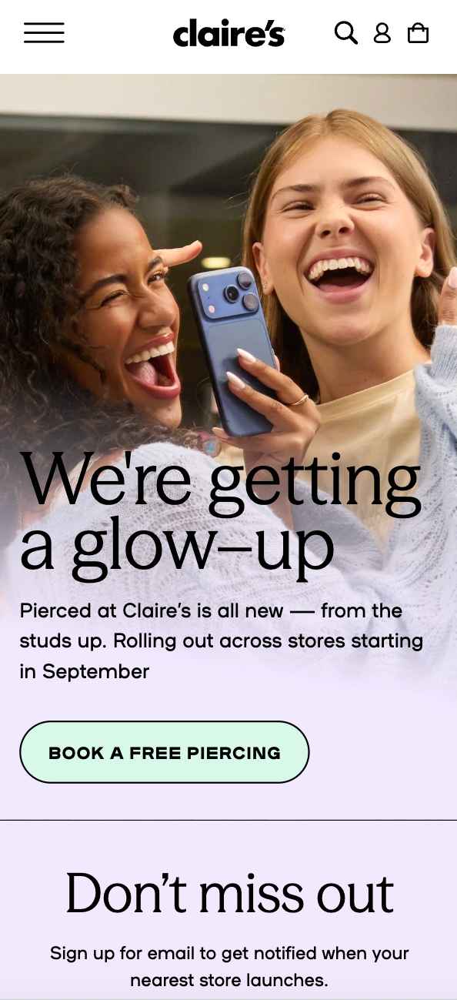

# Procesverslag
Markdown is een simpele manier om HTML te schrijven.  
Markdown cheat cheet: [Hulp bij het schrijven van Markdown](https://github.com/adam-p/markdown-here/wiki/Markdown-Cheatsheet).

Nb. De standaardstructuur en de spartaanse opmaak van de README.md zijn helemaal prima. Het gaat om de inhoud van je procesverslag. Besteedt de tijd voor pracht en praal aan je website.

Nb. Door *open* toe te voegen aan een *details* element kun je deze standaard open zetten. Fijn om dat steeds voor de relevante stuk(ken) te doen.

## Jij

  
uitwerken voor kick-off werkgroep

  ### Auteur:
  Lisa Vandros Tendo

  #### Je startniveau:
  Blauw

  #### Je focus:
  Responsive
 

## Je website

  
uitwerken voor kick-off werkgroep
  Week 1
  Website gekozen en geupload op github:
  

  Week 2

  Week 3

  Week 4

  Week 5

  ### Je opdracht:
 <h1> Website: https://www.claires.com </h1>

  #### Screenshot(s) van de eerste pagina (small screen): 
  Claire's ( homepage) 
  

  #### Screenshot(s) van de tweede pagina (small screen):
  Our glow up
  
 

## Toegankelijkheidstest 1/2 (week 1)

  
uitwerken na test in 2e werkgroep

  
In de les kregen we een oefening waarbij we de toegankelijkheids test moesten uitvoeren van onze website.
  We kregen een aantal objecten waaruit we konden kiezen. Dit waren de objecten.

 De toegankelijkheid test is om te testen en eervaren hoe anderen mensen met een bepaalde aandoening een website kunnen gebruiken.
 Ik heb hierdoor geleerd dat door deze test te doen je meer bewust bent dat je een website maakt voor dat toegankelijk is voor iedereen en voorkomt dat je zomaar beslissing gaat nemen dat de toegankelijkheid juist kan verminderen.
 
 Na deze opdracht werd er een vragen lijst uitgedeeld en mochten we in tweetallen elkaars website checken of ze aan bepaalde regels ( https://www.a11yproject.com/checklist/) hielden.

Ik vond dit onderdeel wel iets meer ingewikkelder, omdat ik niet wist bij sommige onderdelen waar ik precies moest kijken. 
Sommige waren wel te doen. 

 

  ### Bevindingen
  Lijst met je bevindingen die in de test naar voren kwamen:

<h3>Test 1</h3>

voice over 

Bij voice over merkte ik dat de screen reader bleef hangen de slider en ookal je op iets l;ikte je dat je niet verder kon komen. 

 Vlekken bril

 Door gebruik te maken van de vlekken bril is het lastig om je website te zien en 
moet de user met zijn of haar ogen fijn geknepen kijken wat er om  de website staat.  

 elastiek 

 De user vind verliest veel kracht in vingers en heeft wel kracht nodig, om de computer 
elementen te gebruiken om dingen te klikken. Dus klikken gaat lastiger.

 gekleurde bril

 Je ziet sommige kleuren op een andere manier,dus laten ze anderen kleuren zien die 
,minder helder zijn dan de daad werkelijike kleuren. 

<h3>Test 2- Samya mijn website gecheckt</h3>

vragen lijst met mijn website:https://www.claires.com 

<remarks> </remarks>

<h3>Test 3- Lisa Samya's website gecheckt</h3>

vragen lijst met Samya haar website :https://www.benjerry.nl/smaken 

<remarks> </remarks>

## Breakdownschets (week 1)

  
uitwerken na afloop 3e werkgroep

  ### de hele pagina:kkmnn 
  
website used for screenshot:https://screenshotone.com/tools/full-page-website-screenshot/

  
Screenshot van hele pagina zonder schets:  

  <figma link>https://www.figma.com/design/PFzIfHlEsx0mTZ2j4jem24/Untitled?node-id=126-24&t=6Cs9coWRB6grZT9S-1</figma link>

  

  ### dynamisch deel (bijv menu): 
  

  ### wellicht nog een dynamisch deel (bijv filter): 
  
  

## Voortgang 1 (week 2)

  
uitwerken voor 1e voortgang

  vragen voor de voortuitgang. 
  1.

  ### Stand van zaken
  hier dit ging goed & dit was lastig (neem ook screenshots op van delen van je website en code)

  ### Agenda voor meeting
  samen met je groepje opstellen

  | student Lisa   | student Sanna      | student jog   | student 4        |
  | ---            | ---                | ---          | ---              |
  | dit bespreken  | en dit             | en ik dit    | en dan ik dat    |
  | en dat ook nog | dit als er tijd is | nog een punt | dit wil ik zeker |
  | detail- tag uitklap            | ...               | flexbox: grow  | ...              |

  ### Verslag van meeting
  hier na afloop snel de uitkomsten van de meeting vastleggen

  - punt 1
  - punt 2
  - nog een punt
  - ...

## Voortgang 2 (week 3)

  
uitwerken voor 2e voortgang

  ### Stand van zaken
  hier dit ging goed & dit was lastig (neem ook screenshots op van delen van je website en code)

  ### Agenda voor meeting
  samen met je groepje opstellen

  | student 1      | student 2          | student 3    | student 4        |
  | ---            | ---                | ---          | ---              |
  | dit bespreken  | en dit             | en ik dit    | en dan ik dat    |
  | en dat ook nog | dit als er tijd is | nog een punt | dit wil ik zeker |
  | ...            | ...                | ...          | ...              |

  ### Verslag van meeting
  hier na afloop snel de uitkomsten van de meeting vastleggen

  - punt 1
  - punt 2
  - nog een punt
- ...

## Toegankelijkheidstest 2/2 (week 4)

  
uitwerken na test in 9e werkgroep

  ### Bevindingen
  Lijst met je bevindingen die in de test naar voren kwamen (geef ook aan wat er verbeterd is):

## Voortgang 3 (week 4)

  
uitwerken voor 3e voortgang

  ### Stand van zaken
  hier dit ging goed & dit was lastig (neem ook screenshots op van delen van je website en code)

  ### Agenda voor meeting
  samen met je groepje opstellen

  | student 1      | student 2          | student 3    | student 4        |
  | ---            | ---                | ---          | ---              |
  | dit bespreken  | en dit             | en ik dit    | en dan ik dat    |
  | en dat ook nog | dit als er tijd is | nog een punt | dit wil ik zeker |
  | ...            | ...                | ...          | ...              |

  ### Verslag van meeting
  hier na afloop snel de uitkomsten van de meeting vastleggen

  - punt 1
  - punt 2
  - nog een punt
  - ...

## Eindgesprek (week 5)

  
uitwerken voor eindgesprek

  ### Je uitkomst - karakteristiek screenshots:
  

  ### Dit ging goed/Heb ik geleerd: 
  Korte omschrijving met plaatjes

  

  ### Dit was lastig/Is niet gelukt:
  Korte omschrijving met plaatjes

  

## Bronnenlijst

  
continu bijhouden terwijl je werkt

  Nb. Wees specifiek ('css-tricks' als bron is bijv. niet specifiek genoeg). 
  Nb. ChatGpT en andere AI horen er ook bij.
  Nb. Vermeld de bronnen ook in je code.

  1. bron 1
  2. bron 2
  3. ...

