# Procesverslag
Markdown is een simpele manier om HTML te schrijven.  
Markdown cheat cheet: [Hulp bij het schrijven van Markdown](https://github.com/adam-p/markdown-here/wiki/Markdown-Cheatsheet).

Nb. De standaardstructuur en de spartaanse opmaak van de README.md zijn helemaal prima. Het gaat om de inhoud van je procesverslag. Besteedt de tijd voor pracht en praal aan je website.

Nb. Door *open* toe te voegen aan een *details* element kun je deze standaard open zetten. Fijn om dat steeds voor de relevante stuk(ken) te doen.

## Jij

  
uitwerken voor kick-off werkgroep

  ### Auteur:
  Lisa Vandros Tendo

  #### Je startniveau:
  Blauw

  #### Je focus:
  Responsive
 

## Je website

  
uitwerken voor kick-off werkgroep
  Week 1
  Website gekozen en geupload op github:https://lisadrosss-lang.github.io/FED-Lisa-Tendo-2026/
  

  ### Je opdracht:
 <h1> Website: https://www.claires.com </h1>

  #### Screenshot(s) van de eerste pagina (small screen): 
  Claire's ( homepage) 
  

  #### Screenshot(s) van de tweede pagina (small screen):
  Our glow up
  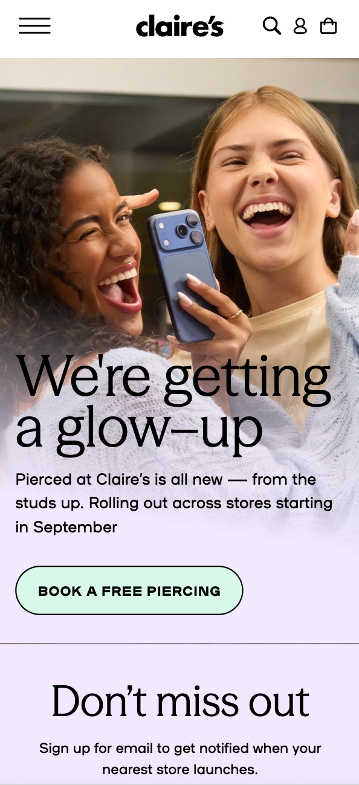
 

## Toegankelijkheidstest 1/2 (week 1)

  
uitwerken na test in 2e werkgroep

  
In de les kregen we een oefening waarbij we de toegankelijkheids test moesten uitvoeren van onze website.
  We kregen een aantal objecten waaruit we konden kiezen. Dit waren de objecten.

 De toegankelijkheid test is om te testen en eervaren hoe anderen mensen met een bepaalde aandoening een website kunnen gebruiken.
 Ik heb hierdoor geleerd dat door deze test te doen je meer bewust bent dat je een website maakt voor dat toegankelijk is voor iedereen en voorkomt dat je zomaar beslissing gaat nemen dat de toegankelijkheid juist kan verminderen.
 
 Na deze opdracht werd er een vragen lijst uitgedeeld en mochten we in tweetallen elkaars website checken of ze aan bepaalde regels ( https://www.a11yproject.com/checklist/) hielden.

Ik vond dit onderdeel wel iets meer ingewikkelder, omdat ik niet wist bij sommige onderdelen waar ik precies moest kijken. 
Sommige waren wel te doen. 

 

  ### Bevindingen
  Lijst met je bevindingen die in de test naar voren kwamen:

<h3>Test 1</h3>

voice over 

Bij voice over merkte ik dat de screen reader bleef hangen de slider en ookal je op iets l;ikte je dat je niet verder kon komen. 

 Vlekken bril

 Door gebruik te maken van de vlekken bril is het lastig om je website te zien en 
moet de user met zijn of haar ogen fijn geknepen kijken wat er om  de website staat.  

 elastiek 

 De user vind verliest veel kracht in vingers en heeft wel kracht nodig, om de computer 
elementen te gebruiken om dingen te klikken. Dus klikken gaat lastiger.

 gekleurde bril

 Je ziet sommige kleuren op een andere manier,dus laten ze anderen kleuren zien die 
,minder helder zijn dan de daad werkelijike kleuren. 

<h3>Test 2- Samya mijn website gecheckt</h3>

vragen lijst met mijn website:https://www.claires.com 

<remarks> </remarks>

<h3>Test 3- Lisa Samya's website gecheckt</h3>

vragen lijst met Samya haar website :https://www.benjerry.nl/smaken 

<remarks> </remarks>

## Breakdownschets (week 1)

  
uitwerken na afloop 3e werkgroep

  ### de hele pagina:kkmnn 
  
website used for screenshot:https://screenshotone.com/tools/full-page-website-screenshot/

  
Screenshot van hele pagina zonder schets:  

  <figma link>https://www.figma.com/design/PFzIfHlEsx0mTZ2j4jem24/Untitled?node-id=126-24&t=6Cs9coWRB6grZT9S-1</figma link>

  

  ### dynamisch deel (bijv menu): 
  

  ### wellicht nog een dynamisch deel (bijv filter): 
  
  

## Voortgang 1 (week 2)

  
uitwerken voor 1e voortgang

  ### Stand van zaken
  hier dit ging goed & dit was lastig (neem ook screenshots op van delen van je website en code)

  Lastig:

  Goed:
  Ik vond de tempo van de lessen wel fijn end dat de docent aangaf wat precies af moest zijn voor bepaalde voortganggesprekken. Daardoor kon ik mij steeds richten op 1 ding. 

  ### Agenda voor meeting
Student 1: Lisa

Vraag 1:
Hoe kan je iconen gebruiken zonder classes?

Vraag 2:
De dingen die in de navbar staan komen in een header te staan, alleen moet ze in 2 of 3 aparte list items?

Vraag 3:
En welke elemeten kan je het beste gebruiken om bepaalde elementen te selecteren inplaat van classes te gebruiken?

Vraag 4:
Bij foto's kan het beste rem of pixels gebruiken om hem responsive te maken? 

Belangrijke punten:
-Gebruik maken van details bij Q en A vragen. ( uitklaptag)
--electeren kan ook met nth CSS selector 
-Als het naar een andere pagina gaat is het een link, als het op de pagina blijft is het een button. Een link kan worden vormgeven als een button zoals bij de meeste navbars.
-div Alleen bij noodgeval ( vormgeving)
-list items wel apart
-detail elements tag 
https://www.w3schools.com/Tags/tryit.asp?filename=tryhtml5_details
- Als je meerdere dingen wil selecteren in css inplaats van div’s  screen reader 
*     section:nth-of-type(1) h2 {
*Als je 2 h2 dan moet je benoemen in welke section de h2 is 
* Goed kijken carusouls flexbox -flexgrow
* Paragraph voor the slider en dan animeren

  Student 2: Jegor
Vraag 1
Hoe kan ik foto's van de website downlaoden zodat de niet stretched zijn? 

Vraag 2 
Hoe moet ik de grid maken zodat alle foto's kloppen?

Belangrijke punten: 
-Gebruik maken van flex grow

Student 3: Sanna

Belangrijke punten:
- Wat wil je dat de screen reader outline.
- Centeren en ruimte - flexbox en grid

haar aantekeningen:
-Je mag geen divjes gebruiken tenzij het voor vormgeving nodig is.
-witruimte gaat om de vormgeving dus dat kan je liever doen met Grid of flexbox
-Dingen die bij elkaar horen groeperen in bijvoorbeeld UL of Selection om het te kunne. flexboxen.
-Je mag geen section gebruiken zonder een heading!
-Button met een link is in je HTML een <A> ( ancor link) en in je CSS stijl je het als een button. 

Student 4:Chennye
Vraag 1:
Welke pagina is het beste als 2de pagina?

Vraag 2: 
Wat kan ik nog meer toevogen in mijn breakdownshets?

Belangrijke punten:-

  ### Verslag van meeting
  hier na afloop snel de uitkomsten van de meeting vastleggen ( algemeen)
  -
  

Na de voortgang 1 heb ik mijn breakdownschets verbeterd aan de hand van de feedback van Danny.

En nog:
-de links veranderd die buttons waren
-selectoren geplaats die bepaalde elementen konden selecteren. 

 
 

## Voortgang 2 (week 3)

  
uitwerken voor 2e voortgang

  website huidige screenshots:
  1ste pagina
  
  
  
  
  
  
  
  
  2de pagina
 
 
 
 
 
  

  ### Stand van zaken
  hier dit ging goed & dit was lastig (neem ook screenshots op van delen van je website en code)
  Lastig:
  Wel lastig om als je selectoren gebruikt je de juiste pad moet schrijven anders selecteert hij hem niet co goed. 

  Goed ging: 
  In het begin vond ik het lastig om de navbar de coderen. Hij staat er wel alleen ben ik niet zo zeker of hij kwa 
  structuur klopt. Ik heb ook van de img een nav element van gemaakt. Verder bij het maken van de opdracht met de sticky code ging het wel goed en heb ik dat ook direct kunnen toepassen op mijn website. 
  De lessen position, flexen header en flex opdracht 1 daarvan heb ik deels mijn code over van genomen. 

  Dingen die ik afgelopen weken heb geleerd.

  In de lessen
  
  Toegankelijkheids les 2
  -Alt helpen mensen die een berperking hebben beter te weten waar de website over gaan. 

  Postioneren les 6
  -Position: relatieve ( placed anywhere),
  -absolute (vast op een plek like a stick note- scrolt niet mee)
  -fixed: ( blijft in beeld ook als je scrolt, zoals ene chatbot)
  -sticky: (blijft ook in beeld, zoals een navbar )

  Theorie op een rijtje 
  Display flex ( NAAST)
  Display grid ( gallerij)

Tijdens het maken van de website:
-Ik heb kwam er achter dat het beter is op elementen een kleurtje te geven. 
-Ik heb geleerd dat "your path" erg belangrijk is als het gaat om het selecteren van bepaald elementen in je html in je CSS zoals nth-type
-Ik heb een bij mijn breakdown schets de lessen waarbij ik bepaalde functies leer er bij gezet zodat ik meer structuur heb. 
Eentje waar je de lessen kan zien waar CSS wordt gebruikt en gekoppeld aan mijn website 
 

 En de andere waar JAVASCRIPT is  gekoppeld aan mijn website 
  

  -Ik heb geleerd hoe ik foto's kan downloaden van de website zelf:
  
   
    
    Je kan hem ook erin slepen in je visual code en dan zou er te voorschijn moeten komen. 

    Je moet goed kijken naar welke account je commit als je via visual code je code commit. Ik heb twee accounts en die raakte in de war per ongeluk,waardoor er twee path's werden gemaakt. wel met behulp van chatGTP heb ik ze weer bij ekaar kunnen krijgen en alles commit kunnen krijgen.

   Terminal: git pull --rebase origin main
   Chatgt link:https://chatgpt.com/share/6abd2312-9934-83ed-94fb-d5841cb7741b
  
   Ik heb geleerd hoe ik mijn website nog steeds responisve kan houden door max-width:100% te gebruiken. Een mede student legt dit uit dat het handig is om naar de waardes te kijken van de website die je wil maken>=.

   Eerst was het zo 

   nu is het zo:

 FIGMA link:
"https://www.figma.com/design/PFzIfHlEsx0mTZ2j4jem24/Untitled?node-id=150-596&t=qojFeLYIgBji5bDc-1"

   

  ### Agenda voor meeting
  samen met je groepje opstellen

   student Lisa   
   Vragen die ik had: 
   Dit is de code die ik gebruikte om een section in het midden te krijgen met de button. 
   Alleen als ik de button kleiner wil maken wordt hij wel kleiner alleen gaat hij telkens
   naar links als ik de width veranderd. De button zit ook een de section en 
   heb van de button een class gemaakt, om hem te kunnen selecteren en stijlen.

    Code:
    display;grid;
    grid-auto-columns:auto;
    place-content:center;
    max-width: 360px;

    Vraag 1: Hoe kan ik controle hebben over een button ookal zit hij in een display:grid? 
     En hoe kan ik hem nog in het midden zetten ookal gaat hij naar links. 
   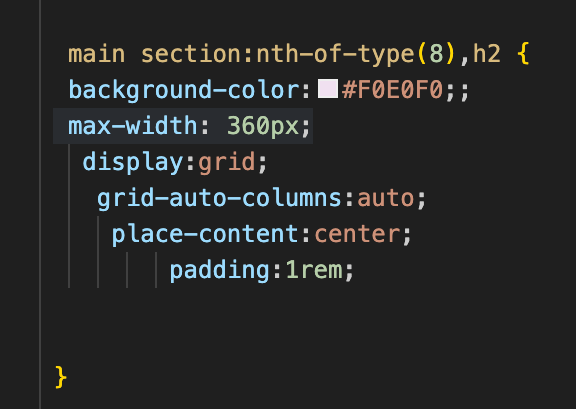
   Selected van grid lines:https://css-tricks.com/complete-guide-css-grid-layout/
    

    Vraag 2:
    Bij het maken van een responsive design is 328px de mobile scherm breedte? Ik heb
    op mijn 12 pro max getest en de breedte is daar 500px?
   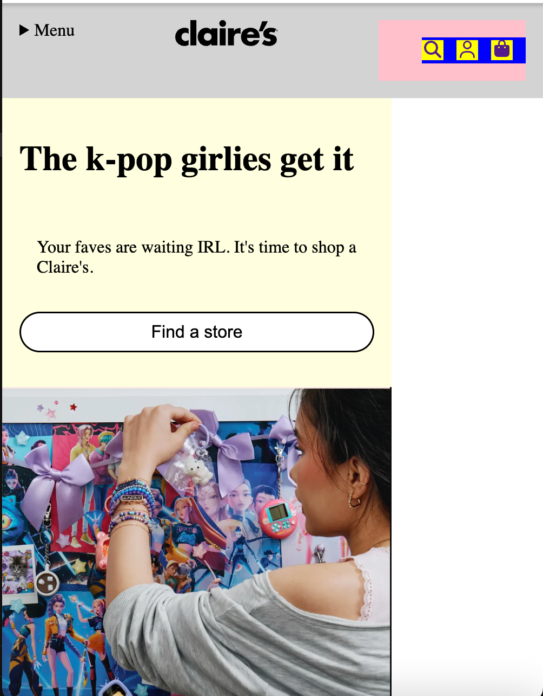
   Antwoord: Het gaat meer van kleine telefoon naar groot formaat dus schermgrootte is niet hier echt van belang.

    Vraag 3:
    Zijn er ook andere selectoren die je kunt gebruiken als je nth-of-type niet kan gebruiken of classes niet kan gebruiken. Ik heb het gevoel dat ik best veel nth-of-type selectors heb in mijn css.
  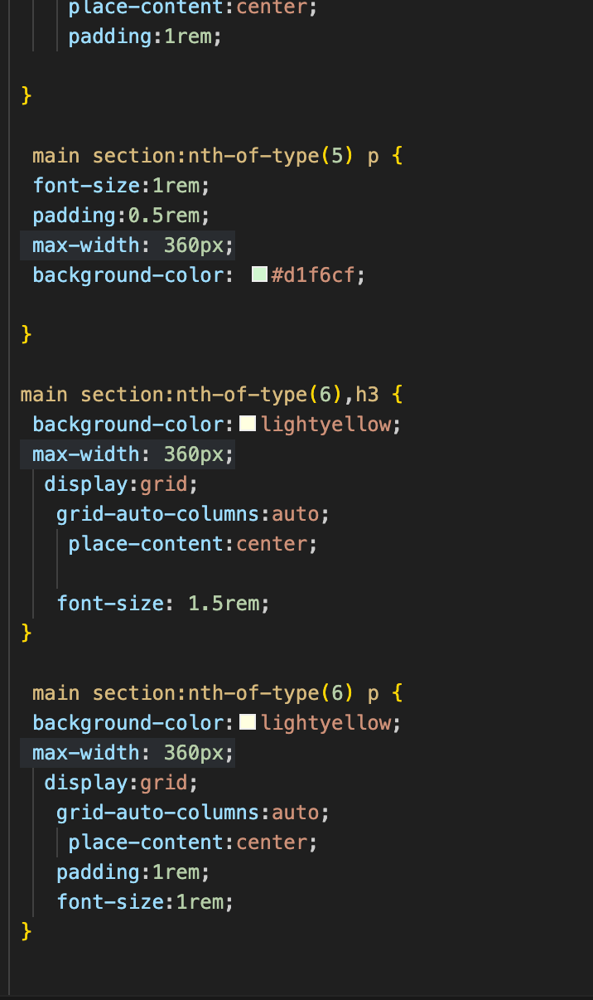

    Vraag 4:
    Hoe krijg je alles op 1 lijn bij de navbar? 
  
  Antwoord:Selected van grid lines:https://css-tricks.com/complete-guide-css-grid-layout/

    Vraag 5:
    De logo heeft nu een navbar element, alleen weet ik niet of dat juist goed is. ik probeerde steeds de
    logo te selecteren anders dan een class te gebruiken. Heeft u tips hiervoor?

    code:

    

                
Menu 

                <ul>
                    <li><a href="/our-glow-up-page.html">Our Glow-Up</a></li>
                    <li><a href="index.html">Piercing Guide</a></li>
                    <li><a href="index.html">Aftercare</a></li>
                    <li><a href="index.html">Explore</a></li>
                    <li><a href="index.html">Store Finder</a></li>
                </ul>
            

            <!--links nav icons-->
        </nav>
        
        <nav>
            <ul>
                <!--LOGO -->
                <!--links nav pages-->
                <li><a href="#"><i class="fa-solid fa-magnifying-glass"></i></a></li>
                <li><a href="#"><i class="fa-regular fa-user"></i></a></li>
                <li><a href="#"><i class="fa-solid fa-bag-shopping"></i></a></li>
            </ul>

        </nav>

Antwoord: gebruik align-self of items of je items te centreren. 
Selected van grid lines:https://css-tricks.com/complete-guide-css-grid-layout/

Vraag 7:
Bij sommige section overlappen ze met een andere code en bij andere niet. Toch gebruik ik dezelfde soort code.
 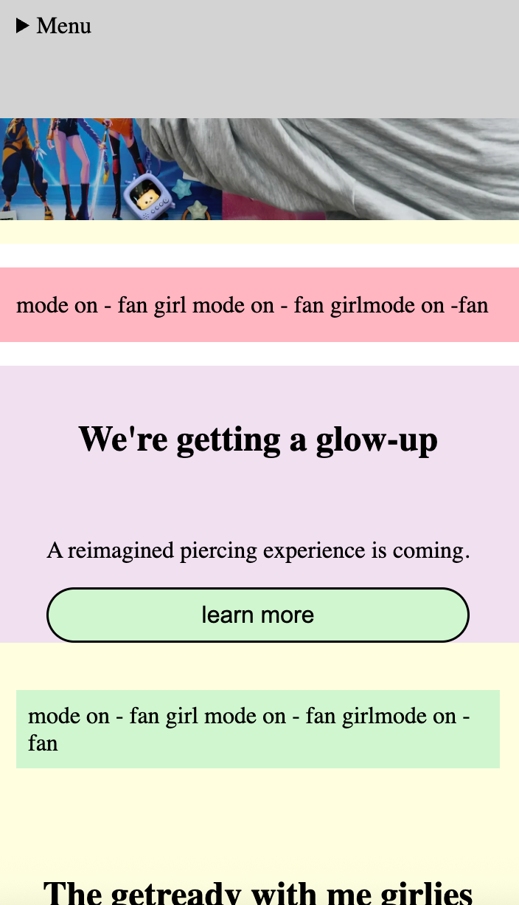
 Antwoord:Je kan dan het beste je elementen CSS resetten (p margin:0)

Vraag 8:
Hoe creer je meer ruimte bij de grid? 
gebruik je dan padding en margin?
Antwoord:Padding

Mijn versie
 

Orginele versie
 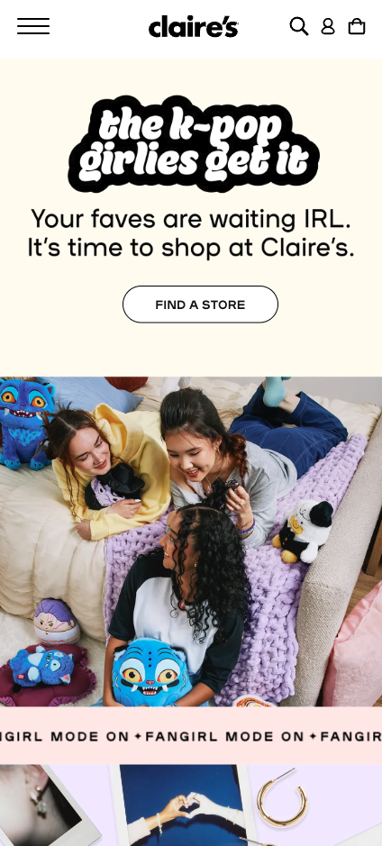

Vraag 9:
Bij foto's kan het beste rem of pixels gebruiken om hem responsive te maken? 
Antwoord:Rem

Belangrijke punten:
-Flex box carusel
-Html fixen 
-CSS bij elkaar zetten. Als je van veel dezelfde hebt.

-Section bij elkaar zetten, dus een section moet wel een h1 hebben, om een section te hebben. De p kan ook bij elkaar. 
Css tricks with grid 
-Selected van grid lines:https://css-tricks.com/complete-guide-css-grid-layout/
-Reset: margin 0,En op alle andere code
-Voor align-self is voor grid 
-Align-items is voor flex

-De afbeeldingen zijn anders omdat ze verschillende formaten hebben. In principe gebruik ik carasoul 

-Ik zag dat hij tijdens het gesprek ook ging kijken naar de 
labels van de code waarmee hij makkelijk en snel kon zien wat waar staat en de precieze afmetingen.
 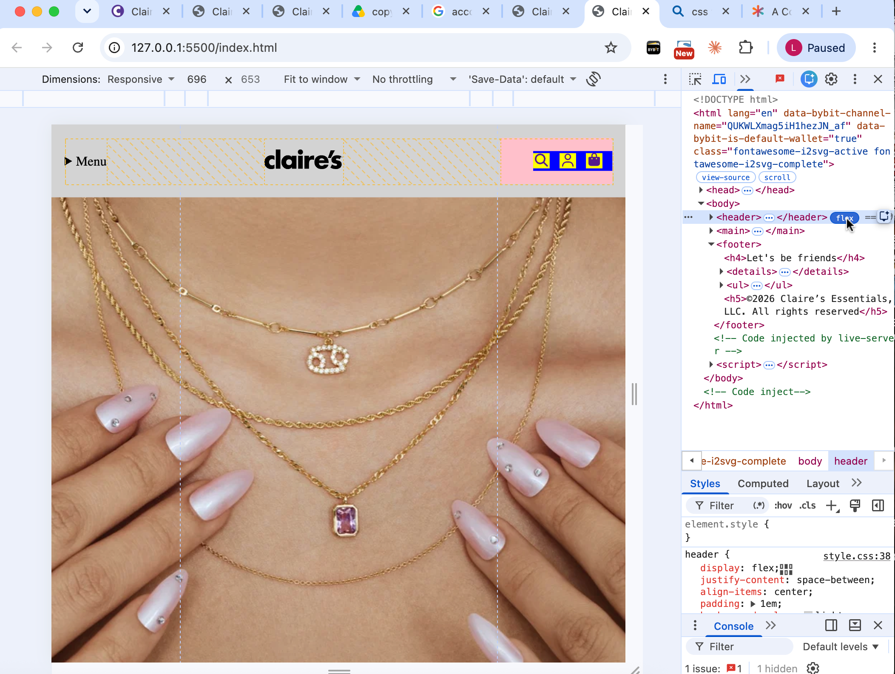

feedback:
-fixen van je html en dan verder gaan met je CSS

Student 2:Chennye
Vraag 1 
Mijn vragen : 
"Hoe zorg ik dat mijn hamburger menu op de voorgrond blijft"

Vraag 2 
"Hoe zet ik mijn list items naast elkaar ipv 2 per grid?"

Vraag 3
"Hoe maak ik de vormgeving links kleiner want buiten de section gebeurd dat wel"

Vraag 4
En afbeeldingen van de website kan je opzoeken via inspecteer element (safari) en dan bronnen aanklikken. En daarna zie je tabjes waarin je afbeeldingen kan aanklikken.

Student 3:Sanna
Vraag 1 
Vraag 2 
Vraag 3
Vraag 4

na gesprek:
Ik heb gelijk na de feedback gesprek mijn website nagelopen en html veranderd door elementen die bij elkaar horen bij elkaar gedaan en ook gelijk het in CSS verwerkt met de juiste benaming. 
- daarbij zag ik dat ik toch soms ruimte tussen bepaalde elementen had doordat ik een padding had en merkte dat je website resetten echt heeft geholpen.
-buttons heb ik kleiner kunnen maken en in het midden gezet 

voor:
 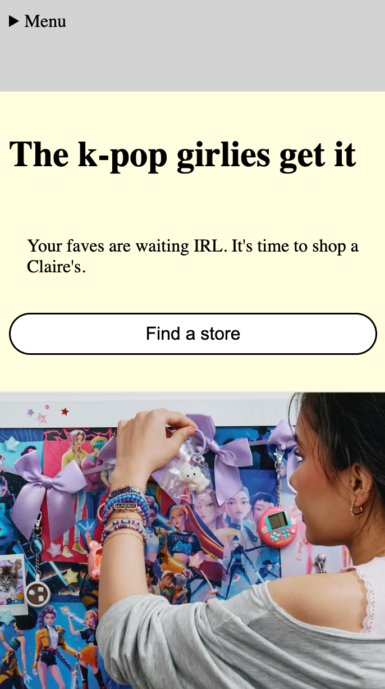

na:
 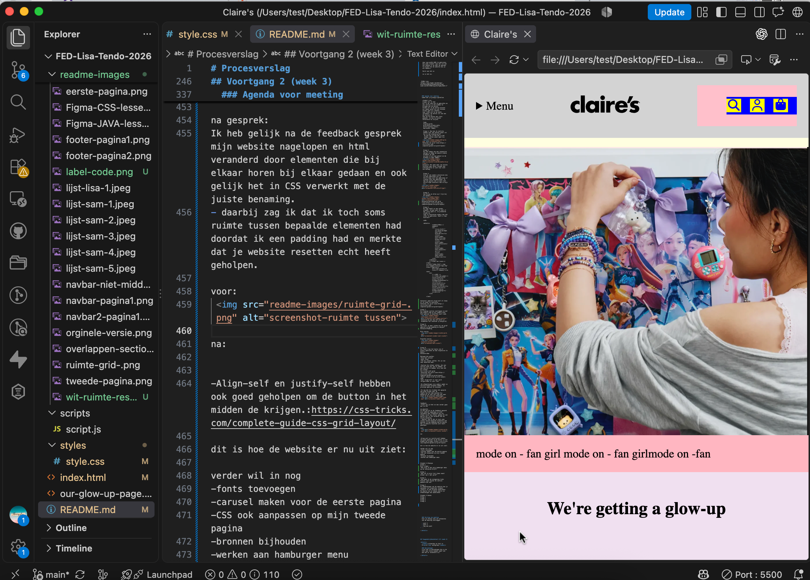

-Align-self en justify-self hebben ook goed geholpen om de button in het midden de krijgen.:https://css-tricks.com/complete-guide-css-grid-layout/ 

dit is hoe de website er nu uit ziet:
 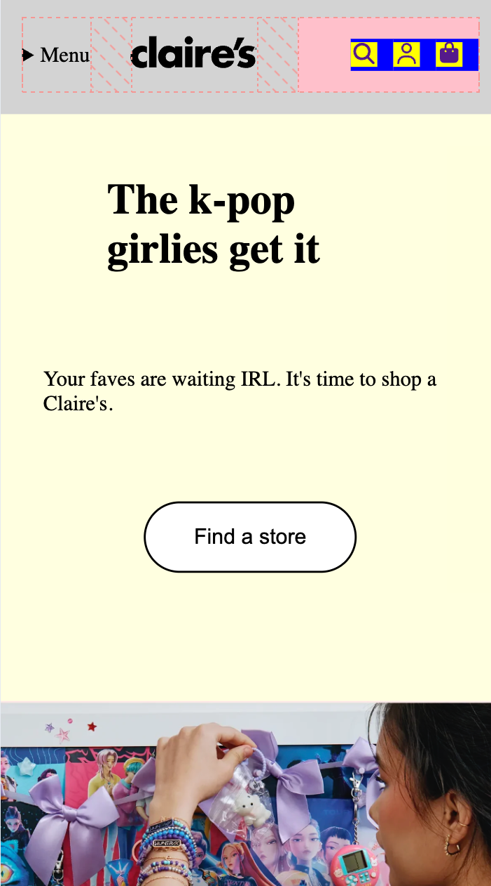
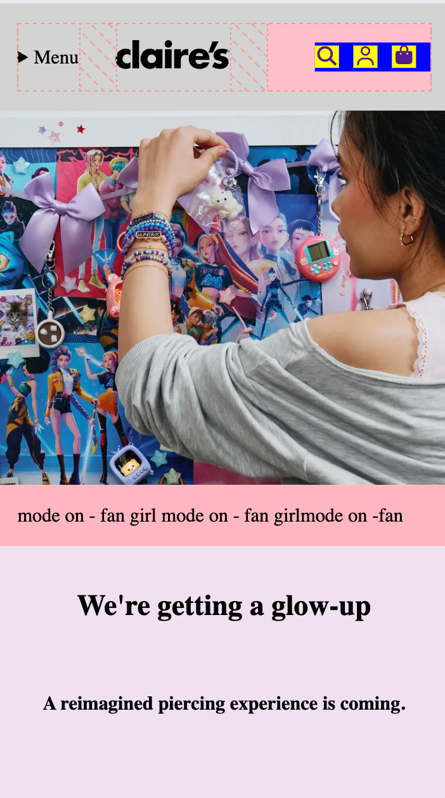
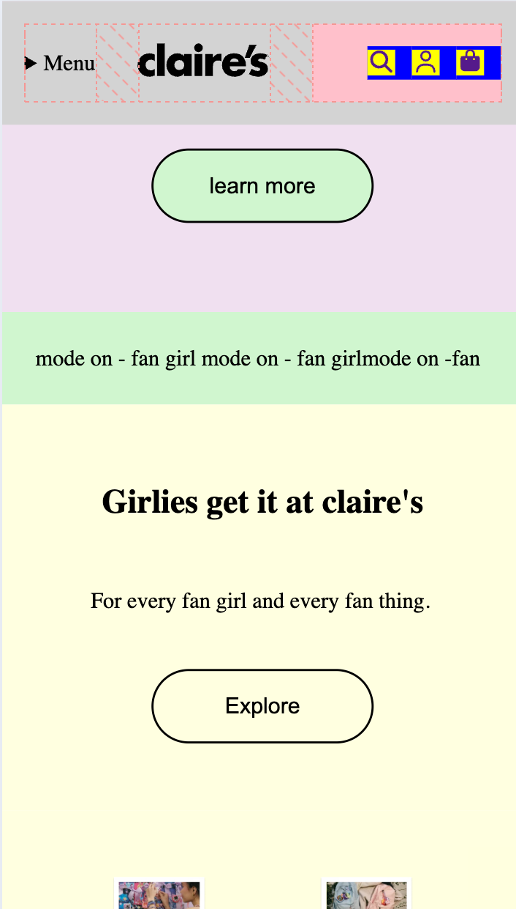
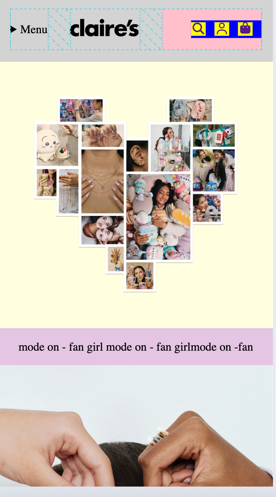

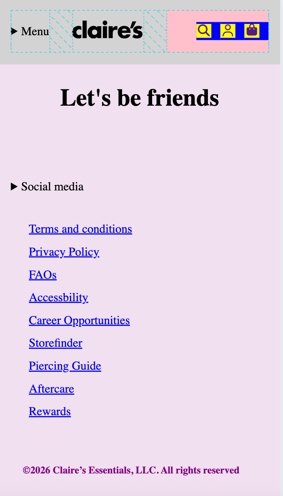

verder wil in nog 
-fonts toevoegen
-carusel maken voor de eerste pagina
-CSS ook aanpassen op mijn tweede pagina
-bronnen bijhouden
-werken aan hamburger menu

opdrachten nog maken:
-hamburger
-carusel
-states ( komt later)

Wat ik nog wel zie waar ik later nog vragen voor heb

  
  

  ### Verslag van meeting
  hier na afloop snel de uitkomsten van de meeting vastleggen

  - punt 1
  - punt 2
  - nog een punt
- ...

## Toegankelijkheidstest 2/2 (week 4)

  
uitwerken na test in 9e werkgroep

  ### Bevindingen
  Lijst met je bevindingen die in de test naar voren kwamen (geef ook aan wat er verbeterd is):

## Voortgang 3 (week 4)

  
uitwerken voor 3e voortgang

  ### Stand van zaken
  hier dit ging goed & dit was lastig (neem ook screenshots op van delen van je website en code)

  ### Agenda voor meeting
  samen met je groepje opstellen

  | student 1      | student 2          | student 3    | student 4        |
  | ---            | ---                | ---          | ---              |
  | dit bespreken  | en dit             | en ik dit    | en dan ik dat    |
  | en dat ook nog | dit als er tijd is | nog een punt | dit wil ik zeker |
  | ...            | ...                | ...          | ...              |

  ### Verslag van meeting
  hier na afloop snel de uitkomsten van de meeting vastleggen

  - punt 1
  - punt 2
  - nog een punt
  - ...

## Eindgesprek (week 5)

  
uitwerken voor eindgesprek

  ### Je uitkomst - karakteristiek screenshots:
  

  ### Dit ging goed/Heb ik geleerd: 
  Korte omschrijving met plaatjes

  

  ### Dit was lastig/Is niet gelukt:
  Korte omschrijving met plaatjes

  

## Bronnenlijst

  
continu bijhouden terwijl je werkt

  Nb. Wees specifiek ('css-tricks' als bron is bijv. niet specifiek genoeg). 
  Nb. ChatGpT en andere AI horen er ook bij.
  Nb. Vermeld de bronnen ook in je code.

  1. bron 1
  Img height and width 
  -https://www.w3schools.com/howto/howto_css_image_responsive.asp

  2. bron 2

  Buttons
  -https://www.w3schools.com/TAGs/tryit.asp?filename=tryhtml_button_css

  -https://www.w3schools.com/TAGs/tryit.asp?filename=tryhtml_button3

  3. bron 3 
  voor iconen navbar 
  
  -link icons https://www.youtube.com/watch?v=ihTB-aZ-Msk,
  -https://www.w3schools.com/html/html_layout.asp
  -https://cdnjs.com/libraries/font-awesome
  -https://fontawesome.com/icons/classic/solid/bag-shopping
  -https://www.youtube.com/watch?v=E2Er0ntd1yU-->
  -https://fontawesome.com/start/confirm

    4. bron 4
   -https://css-tricks.com/almanac/properties/b/backdrop-filter/
   -https://www.w3schools.com/css/css_z-index.asp

    5. bron 5

